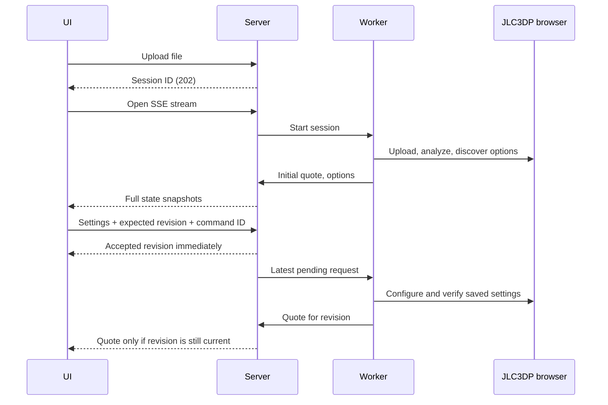

# Interactive quote prototype

Start from `click-to-ship/`:

```sh
npm ci
python3 server.py --port 8766
```

Open **http://127.0.0.1:8766**. Python's standard library serves the UI, commands, and Server-Sent Events (SSE). The npm install provides pinned viewer libraries; no frontend build is required. Assets are served locally, with no runtime CDN dependency. The worker uses the existing browse CLI and local Chrome to interact with JLC3DP. Choose your own file or use the included 20 mm cube.

## Interaction

The interface has three steps. **Check your model** opens a local, interactive geometry preview and collects quantity, product category, and a description. **Choose material** offers process, material, and color choices while upload and analysis continue. **Review your quote** automatically requests the configured estimate. Users can go back and compare choices; revisiting unchanged steps does not start another quote.

Rendering and uploading start together. Drag to rotate, scroll to zoom, toggle wireframe, or reset the view. STL and OBJ coordinates are interpreted in millimeters; STEP and 3MF units are converted to millimeters. The preview shows geometry, not a simulation of the selected manufacturing material. Its dimensions are compared with JLC3DP's dimensions and a discrepancy is displayed if they differ.

Early material/color choices use options actually observed during previous JLC3DP sessions, stored in `artifacts/material-catalog.json`. They are labeled as previously seen and awaiting a model check. A fresh installation without that cache can still select a process and its default material while the first session discovers the catalog. No cached price or compatibility decision is treated as current.

Choices submitted during upload are accepted immediately and queued. They do not cancel the upload. After bootstrap, the worker applies the latest pending choices and verifies them on JLC3DP. The initial default quote remains identified as a default quote when it differs from those choices.

Entering review submits the current choices; **Refresh estimate** can request another price. The manufacturing price is published after the worker verifies saved settings. Shipping arrives in a separate event. A previous estimate stays visible with its original material and quantity, explicitly labeled whenever it differs from the current draft or submitted revision.

Finish, threads, packaging, and build speed retain provider defaults. US/USD is the current supported region. No order or payment controls are exposed. This is a local prototype with a 20 MB upload limit and four active sessions maximum.

## Synchronization contract



- **One worker owns one browser.** HTTP handlers never drive that browser, and two operations never mutate it concurrently.
- **Accepted settings advance the revision.** Every options payload and quote is tagged with its revision. The UI compares the quote's revision and configuration with the user's draft.
- **The latest pending request replaces older pending requests.** Initial upload checks only for session closure, so early choices cannot accidentally cancel it. After bootstrap, an active request checks for supersession before each browser command and poll, then yields to the newest request. It does not retry an order action.
- **Stale results cannot publish.** Publication checks the current revision under the same lock used to accept requests. This closes the race between a final browser result and a newly submitted change.
- **Commands are idempotent.** Reusing a command ID with the same payload returns its original accepted revision. Reusing it with a different payload or submitting against an outdated revision returns HTTP 409.
- **SSE sends full snapshots with increasing event IDs.** Reconnects receive the latest complete state. UI page reloads restore the session, current step, local draft, and pending intent from local storage, fetch the latest server state, and reopen the uploaded file's preview without re-uploading it to JLC3DP.
- **Incompatible settings preserve the previous quote.** Options and warnings still update; the UI never marks that old quote as current. A later valid request can recover within the same browser session.

## Endpoints

| Endpoint | Purpose |
|---|---|
| `POST /api/sessions?filename=part.stl` | Raw file bytes → session, async start |
| `POST /api/sessions/demo` | Start with the included fixture |
| `GET /api/sessions/{id}` | Latest full state |
| `GET /api/sessions/{id}/model` | Original file for restoring the preview |
| `GET /api/catalog` | Previously observed, explicitly provisional material/color options |
| `GET /api/sessions/{id}/events` | SSE full state updates |
| `POST /api/sessions/{id}/commands` | Submit `inspect` or `quote` |
| `DELETE /api/sessions/{id}` | Close the session and stop its browser at the next checkpoint |

Command shape:

```json
{
  "command_id": "client-generated-uuid",
  "expected_revision": 0,
  "action": "quote",
  "config": {
    "technology": "SLA",
    "material": "Black Resin",
    "color": null,
    "quantity": 2,
    "category": "blocks",
    "description": "20 mm resin test cube"
  }
}
```

Null material/color means use the selected process/material's default. The result returns the actual observed values. A process change should clear material and color; a material change should clear color.

## Diagnostics and tests

Every session stores the uploaded file, `state.json`, and an append-only `events.jsonl` under `artifacts/web/{id}/`. The UI's collapsed **Session details** shows desired settings, observed settings, and revisions. These details are useful while testing this prototype and can be removed from the product UI later.

Run the deterministic concurrency tests:

```sh
python3 -m unittest -v test_sessions.py
python3 test_preview_browser.py
```

The five session tests exercise superseded requests, coalescing, idempotency, stale-client conflicts, incompatible-material recovery, snapshot isolation, and choices accepted during a deliberately slow upload. They use a controlled fake adapter. The preview test runs the actual viewer through browse, checking ASCII/binary STL, OBJ, inch-based 3MF, STEP unit conversion, wireframe, and reset controls without creating provider sessions.

The viewer uses [Three.js loaders](https://threejs.org/docs/pages/STLLoader.html) and [OCCT Import JS](https://github.com/kovacsv/occt-import-js). STEP tessellation runs in a Web Worker so the form remains responsive. Viewer failures leave the quoting flow usable; large CAD files can take longer than the small fixtures.

## Theme study

Open `http://127.0.0.1:8766/theme` to compare Landing, Build, and Quote with one persistent interactive sample model. The conversation and manufacturing fields in this study are illustrative; `/` remains the functional quoting prototype. Both use `web/theme.css`. See [THEME.md](THEME.md) for the visual foundation.

State lives in one server process. Reloading reconnects to an existing session; restarting the server requires a new session. Idle sessions close after 15 minutes without a submitted change. The server binds to loopback and rejects cross-origin commands.
